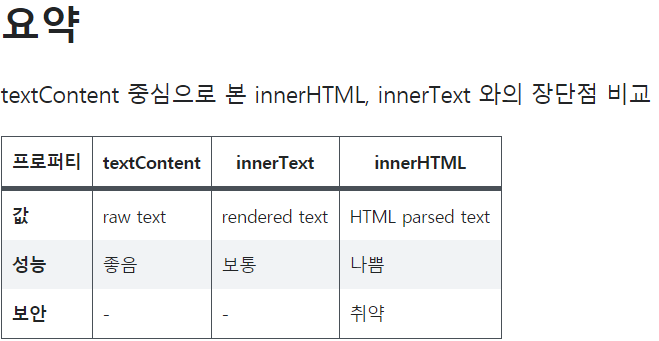

# ES2020-JavaScript #2-1

### 끝말잇기 순서도 그리기

- div에 텍스트를 넣는 방법은 `.innerHTML` 이고 추가적으로 넣기 위해 += newword 를 하여서 계속해서 추가해 나갔다.

- 찾아보니 `.innerHTML` 말고 `.textContent` 를 사용하는 게 좋다.

  출처: [https://velog.io/@raram2/%EB%8B%B9%EC%8B%A0%EC%9D%B4-innerHTML%EC%9D%84-%EC%93%B0%EB%A9%B4-%EC%95%88%EB%90%98%EB%8A%94-%EC%9D%B4%EC%9C%A0](https://velog.io/@raram2/당신이-innerHTML을-쓰면-안되는-이유)

  이 글을 보면 innerHTML 보다 textContent 사용을 권한다.

  

  왜냐하면 innerHTML가 대표적인 XSS(Cross-Site Scripting) 공격에 취약한 사례로 언급된다는 점 때문이다. 그래서 프로젝트가 보안 점검을 거치게 되는 프로젝트인 경우, innerHTML을 사용하면 코드가 거부 될 가능성이 높습니다.

  __결론은 가급적 textContent를 사용하는 게 성능과 보안에 강점이 있고, 해당 노드의 raw text를 얻게 됨으로써 이후 의도한 대로 가공할 수 있기 때문입니다.__

  

## #2-2 끝말잇기 구현하기와 주석

## #2-3 문자열과 인덱스

- 변수에 저장되는 자료형의 종류

  String, Number, Boolean, Object(객체), Null, Undefined, Symbol

- JS에서는 'a'나 '', ""과 같은 것도 모두 __문자열__ 이라 부른다.

- `` 백틱 따옴표는 앞에 ${}를 붙여서 사용하는 특수한 문자열이다.

## #2-4 끝말잇기 구현하기2

- `document.querySelector('#new').focus()` 

  .focus() 클릭하지 않아도 커서가 자동으로 올라가 있다.

## #2-5 변수 값 수정과 상수

- 변수를 바꾸는 경우에는 `let`, 불변의 상수는 `const`

## #2-6 변수의 생명(블록 스코프)

- __블록 내 모든 변수는 블록 시작할 때 생성되고 블록이 끝나면서 다 죽는다.__

  즉 그 함수를 계속 실행한다고 누적되는 것이 아닌 그 양만큼만 메모리가 들었다가

  삭제됐다가 하는것. 중복제거 할때 위로 올리면 변수의 생명주기가 늘어나는 것

  

- 단어장을 만들어서 중복된 단어가 나온다면 '중복단어입니다' 출력하자

  배열 안에 단어가 있는지 체크하는 함수는 `배열.includes('단어')` 이다.

  추가는 `.push()` 이다.

## #2-7 강좌 마무리

- 변수명은 최대한 의미를 알아볼 수 있게 작성하는 게 좋다.

- 계산기 순서도를 그려보자.